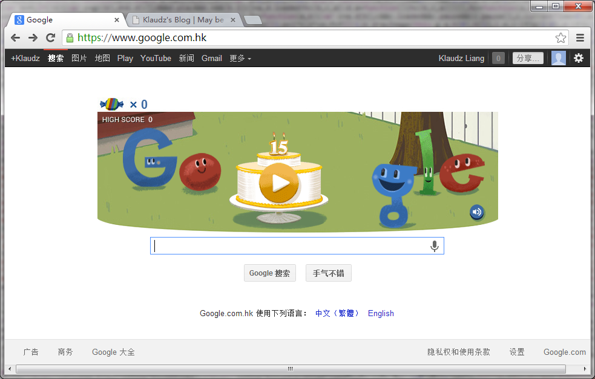
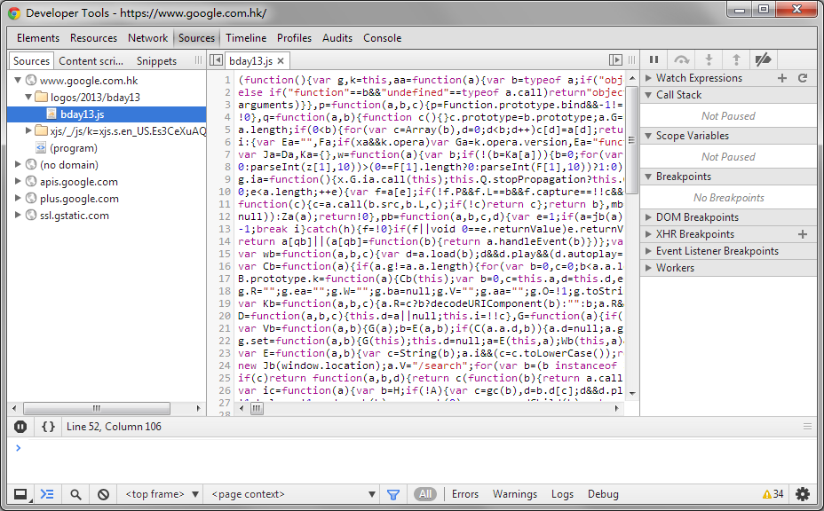
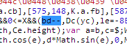
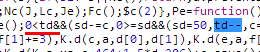
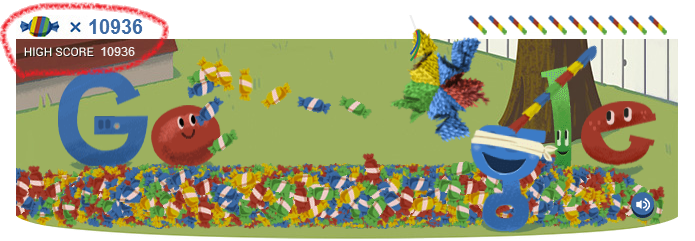
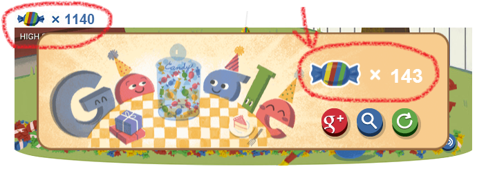
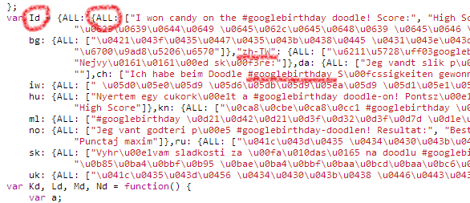
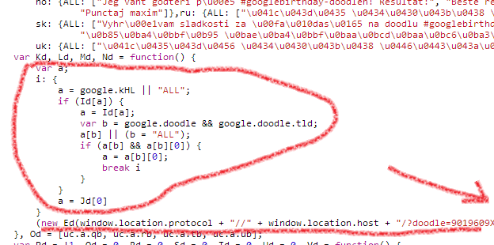
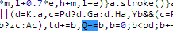
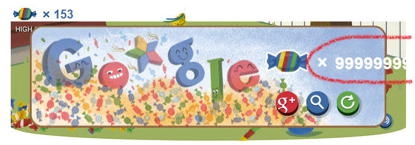

今天乃google 15周年纪念日，主页上如期换了生日doodle。此doodle上除了一个标识着15周年的蛋糕外，还是一个敲糖果的小游戏。 （过了今天，你可以在[http://www.google.com/doodles/googles-15th-birthday](http://www.google.com/doodles/googles-15th-birthday "doodle of google's 15th birthday")体验。） 可能是受之前同事破解微信打飞机的影响吧，冰封了三四年的破解欲立刻被这个html5的小游戏勾起来。（阴笑）

废话不多说，直入主题吧，下面会分享一下破解的一些思路和过程。

1. # 初步分析
    
    首先开了Developer Tools，我用的是Chrome。 在Sources很容易就发现了"bday13.js"，很明显意思就是“birthday of 2013”。
    
    从代码看出，虽然脚本被Google Closure Compiler压缩过，变量名都都变成abcd，但其实不会有太大影响。 玩一下这个游戏就能知道，影响分数的无非就是两个参数，其一是可以敲糖果的次数，其二是糖果掉下的数量。 再深入想想，敲糖果次数是递减1，而糖果掉下来越来越少很可能也是递减1来实现的。
2. # 日后再说
    
    这样就简单了，递减1的实现最常用就是“--”，搜索一下发现有12处，最后排查到两个位置：
    
    (1) bd-- 这个“bd”是就是控制敲糖果的次数的，把“bd--”改为“bd++”，这样每敲一次可用次数就增加一次了，哈哈~ 
    
    (2) td-- 别满足于敲击次数的增加，一次次地敲，键盘都烂了，得不偿失。 我们发现这里的“td”是控制一次敲击糖果数量慢慢递减掉下的变量，把“td--”改为“td++”就可以让糖果一劳永逸地自动掉下了，哈哈~ 当然，细心阅读代码会发现，“td--”前方有“0<td&&”的条件控制，猜测可知当td>0的时候才会掉糖果并作一些逻辑处理，那我们直接把“0<td&&”改为“true&&”就更狠了，这样游戏未开始就已经会自动掉糖果了。→\_→ 
    
    我们保存修改的js后，立即看看效果吧~ 满地糖果，1W分不是梦！ 
3. # 永远不要高兴那么早！
    
    悲观主义者不是说做什么事都作好最坏的打算么？我们发现当游戏结束时，最后得分与实时分数并不一致，OMG！ 看来Google还是有做一些安全措施啊。。。 
4. # 传统的字符串分析
    
    但其实也很好分析，最终得分是由敲击时通过某些逻辑去增加的，而不是全量由实时分数取得。 难道真的要看着这坨压缩过的代码去分析算法吗？ 正纳闷的时候，灵机一动！ 我记得分数结束时有个Google+的分享按钮，上面的分享内容是“我玩#googlebirthday 涂鸦赢了糖果！我的分数： XXX”。 字符串是最容易搜索的，那字符串附近一定出现了这个得分的变量。只要知道这个变量是什么，就可以很容易修改分数增加的算法了。 立马一翻那坨js，找到了Unicode字符串的转码，用解码工具翻译了果然就是那句话不同国家语言的对应的wording。 而且默认语言和各国语言是以JSON存储在Id变量上的。例如要拿到默认语言是Id.ALL.ALL，中文翻译是Id.zh-cn.ALL。 
    
    局面一下变得明朗了，相关代码一定在附近。 果然不出所料，下方就是拼接Google+分享地址和内容的代码。  定位到这句代码：
    
    \[js\] (new Ed(window.location.protocol + "//" + window.location.host + "/?doodle=9019609X" + Q, window.google.doodle.alt, a + " " + Q, "https://www.google.com/logos/2013/bday13/share\_" + ((25 > Q ? 0 : 100 > Q ? 1 : 180 > Q ? 2 : 3) + 1) + ".png")).o() \[/js\]
    
    看到“png”我就很确定是分享的图片了，中间有段逻辑是图片地址的拼接。
    
    \[js\] "https://www.google.com/logos/2013/bday13/share\_" + ((25 > Q ? 0 : 100 > Q ? 1 : 180 > Q ? 2 : 3) + 1) + ".png" \[/js\]
    
    不难读出，Google把分数分成了4个层次，低于25分、低于100分、低于180分和高于等于180分，最高分的图片地址显然是[http://www.google.com/logos/2013/bday13/share\_4.png](http://www.google.com/logos/2013/bday13/share_4.png)。 而这个“Q”变量就是存储着最终得分。
5. # 把子孙根牢牢抓住
    
    我们只需要搜索一下“Q”在哪里赋值就好了。（因为搜索时发现“this.Q”，所以确定了“Q”类属性，而非临时变量，所以无论代码经过怎么压缩，“Q”的名字是不会变的。） 首先搜索“Q=”，发现全部都是填0，也就是全是初始化语句。 再搜“Q++”，没有找到。 这样“Q+=”就很大机会了，果然不出所料，让我们定位了代码。 
6. # 笑到最后
    
    不想那么多了，把“Q+=b”改为“Q+=9999999999999”，保存代码，随便敲几下糖果让游戏快点结束吧！ 
