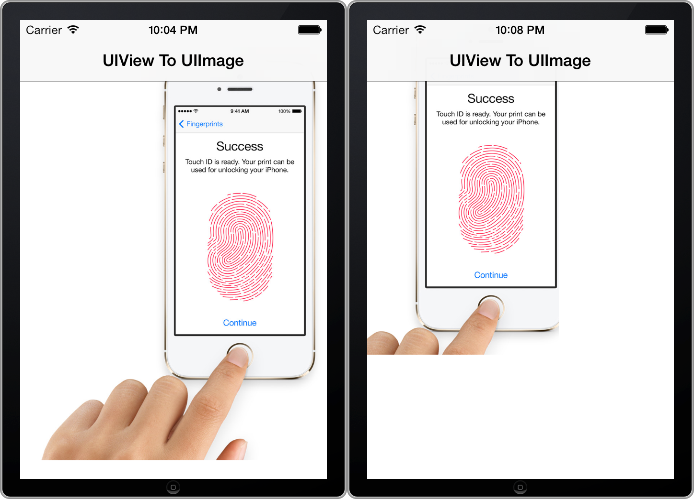

一直就没记着把UIView截成UIImage的那几行代码，因为不经常使用，而且函数名有点长。。。 特此记录，方便以后查阅。

不妨写一个UIView的类别方法

\[objc\] @interface UIView (UIImageConverter) - (UIImage \*)convertedImage; - (UIImage \*)convertedImageWithFrame:(CGRect)frame; @end \[/objc\]

1. # 把整个UIView截取UIImage
    
    下面我们去实现第一个类别方法。
    
    \[objc\] - (UIImage \*)convertedImage { // 开始画image UIGraphicsBeginImageContextWithOptions(self.frame.size, NO, 1.0); // 获得当前的图形上下文 CGContextRef context = UIGraphicsGetCurrentContext(); // 把UIView的layer \[self.layer renderInContext:context\]; // 从当前的图形上下文取得图片 UIImage \*image = UIGraphicsGetImageFromCurrentImageContext(); // 结束画image UIGraphicsEndImageContext(); return image; } \[/objc\]
    
    可以看出，主要是 -\[CALayer renderInContext:\] 的作用 值得注意的是，我们可以从"UIGraphics.h"从看出 UIGraphicsBeginImageContextWithOptions(CGSize, BOOL, CGFloat) 只能用在iOS 4以上，iOS 4以下需使用 UIGraphicsBeginImageContext(CGSize);
    
    \[objc\] UIKIT\_EXTERN void UIGraphicsBeginImageContext(CGSize size); UIKIT\_EXTERN void UIGraphicsBeginImageContextWithOptions(CGSize size, BOOL opaque, CGFloat scale) NS\_AVAILABLE\_IOS(4\_0); \[/objc\]
2. # 截取UIView的部分
    
    上面的方法是从整个UIView截取出图片，如果你有需求截取UIView的某一块（可能通过一个frame），则需要使用到以下的方法：
    
    \[objc\] CGContextTranslateCTM(CGContextRef c, CGFloat tx, CGFloat ty) \[/objc\]
    
    那么我们就实现第二个方法，如下：
    
    \[objc\] // 提供frame参数作为截取的范围 - (UIImage \*)convertedImageWithFrame:(CGRect)frame { // 开始画image，size为frame.size UIGraphicsBeginImageContextWithOptions(frame.size, NO, 1.0); CGContextRef context = UIGraphicsGetCurrentContext(); // 对图形上下文做平面转换(平移)，由frame.origin决定 CGContextTranslateCTM(context, -frame.origin.x, -frame.origin.y); \[self.layer renderInContext:context\]; UIImage \*image = UIGraphicsGetImageFromCurrentImageContext(); UIGraphicsEndImageContext(); return image; } \[/objc\]
    
    
3. # Fixed for Retina
    
    上面的代码还有不足，从效果图可以看出，在Retina屏转换到的图片很模糊，显然只是截得了低清图。 为了弥补不足，作了如下得修改：
    
    \[objc\] CGFloat scale = \[UIScreen mainScreen\].scale; UIGraphicsBeginImageContextWithOptions(frame.size, NO, scale); \[/objc\]
    
    第三个参数scale是缩放倍数，在Retina下，scale应设为2.0。 可以通过 \[UIScreen mainScreen\].scale 来判断设备是否为Retina。
    
    
