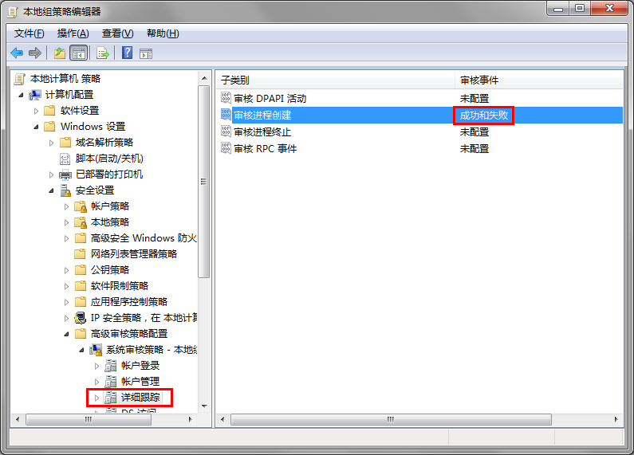
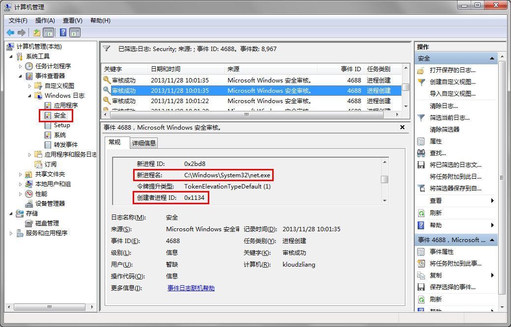
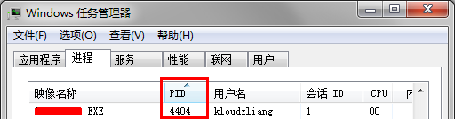

# 背景

事情起因是这样的。 最近发现公司的PC每天至少会弹一次net命令的窗口。我不得不起疑心，究竟是公司下的策略，还是我已被肉鸡？ 好奇心驱使我去寻根问底。

# 思考

首先，我需要知道，究竟是谁把net弹出来，而且做得如此不彻底，竟然不在后台调用。 此时立刻想到了IceSword这一类杀毒利器可以监控进程创建和关闭等信息。不过IceSword也已经多年不更新了，也懒得下一个在Win7跑。 写驱动，还是算了吧，不想大费周章去Hook。

遂与Shawn讨论方法，Shawn果然满足了我的XX。 本地组策略（gpedit.msc）原来就提供了相关策略配置，而且非常简单！

# 方法

如下：

1. ## 审核进程创建
    
    打开“本地组策略（gpedit.msc）”，左侧列表打开“计算机配置——Windows 设置——安全设置——高级审核策略配置——系统审核策略——详细跟踪”，右侧双击“审核进程创建”，把配置“成功”和“失败”勾上。至此，审核进程创建已经配置完毕。 
2. ## 查看日志
    
    打开“计算机管理（“计算机”右键“管理”，或compmgmt.msc）”，左侧“系统工具——事件查看器——Windows 日志——安全”，右侧即可看到Windows有关安全的事件日志。 使用筛选器筛选出进程创建的事件（事件ID为4688），最终根据大概的时间段，找到net.exe创建的日志，可以看到创建者进程ID（PID）是0x1134，即十进制4404。 
3. ## 追寻创建者进程
    
    最后在任务管理器中，发现了PID为4404的进程，找出了进程的创建者是S\*\*\*\*\*\*\*\*.EXE。果然是公司下发的策略！ 
