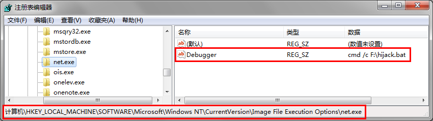
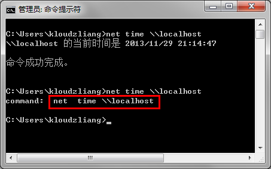
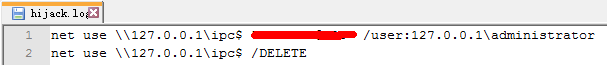

# 前情提要

学习美剧写下前情提要吧。 最近发现公司的PC每天至少会弹一次net命令的窗口。我不得不起疑心，究竟是公司下的策略，还是我已被肉鸡？ 终于在Shawn的提点下，用本地组策略找出了元凶。（[监控Windows进程创建（一）——本地组策略](/2013/12/02/monitoring-the-process-of-creating-in-windows-by-using-gpedit/)） 但显然我的好奇心没有这么容易被满足，我更希望知道，它调用net命令究竟做了什么。

# 思考

显然我的提问已经很明确了，作为命令行命令，就是想知道这个net被调用时的命令行。 当然，系统的任务管理器和一些进程工具的确可以看到进程的命令行，但我们不知道net命令什么时候被调用，而且net也是稍纵即逝。 跟上一篇一样，我可不想写Windows驱动。。。

此时就像柯南脑子后面一闪，TM想到了。 没错，说了这么多废话，终于说到了标题的映像劫持了。

# 科普

映像劫持，Image File Execution Options（下面简称IFEO），也有人称Image Hijack，是Windows NT提供的系统功能，在系统环境运行时引发程序错误时，可以使用IFEO调试程序。 设置注册表IFEO相关的项，可以使**指定文件名**的可执行程序（**无论什么路径**）无法执行，转而执行其他命令。 例如，在IFEO设定了avp.exe（卡巴斯基）项，指向virus.exe（某病毒路径），那么当你想打开avp.exe时，其实打开了virus.exe。 现在你可能意识到了什么。

# 回忆

如果在07、08年有接触过Windows病毒相关的朋友，应该不会陌生。 不记得是06年底还是07年初，Winguse带着我涉足Windows安全领域。也是在那时候开始，我们一起见证U盘病毒的诞生与成长。 我印象中我捕获的第一个使用映象劫持的病毒样本是SXS.EXE，橙色八月的变种，Win2000笔记本图标。 在运行样本后，测试系统很多杀软、工具都无法打开，病毒本体却被再次执行。病毒正是使用了IFEO的特性让杀软和工具挂球的。 就算你把病毒杀除，但如果没有恢复IFEO项，安全软件依旧无法正常打开，因为IFEO的劫持项依旧在。 后来使用映像劫持的病毒越来越多，例如磁碟机、AV终结者（这里的AV==Anti-Virus，不是Adult Video谢谢）、机器狗等有名的病毒。 当然再后来，很多安全软件也对此作了检测和自我保护。

# 开搞

1. 设置映象劫持
    
    - 打开“注册表编辑器（regedit）”，找到路径“HKEY\_LOCAL\_MACHINE\\SOFTWARE\\Microsoft\\Windows NT\\CurrentVersion\\Image File Execution Options”，在其下新建“项”，名为“net.exe”。 （此名就是要hijack的文件名，**只要文件名符合，无论什么路径都会被hijack**。）
    - 右侧为“net.exe”新建“字符串值”，名称为“Debugger”，值为“cmd /c F:\\hijack.bat”。 （此值就是要替代net.exe执行的命令，而且**被hijack的文件的原命令行里的参数，也会直接传给新的替代命令**。）
    
    
2. hijack脚本 1中已指定脚本路径“F:\\hijack.bat”，下面是测试代码： \[c\] @echo off echo.command: %\* ::打印脚本收到的参数 \[/c\]
    
    测试一下，在cmd敲“net time \\\\localhost”，hijack.bat被执行，并打印出“command: net time \\\\localhost”，正是net命令被调用的命令行。成功hijack！ 
3. 正式监控 把hijack.bat修改一下，输出日志文件记录。 \[c\] @echo off echo.%\* >> "%~dp0hijack.log" ::把参数写入脚本所在文件夹的hijack.log文件 ::%~dp0为脚本所在目录的绝对路径 \[/c\]
4. 收割 等待，终于在hijack.log中发现了记录。原来是对本地管理员用户进行空连接。 
5. 清理 工作完成后记得清理映像劫持相关注册表。
